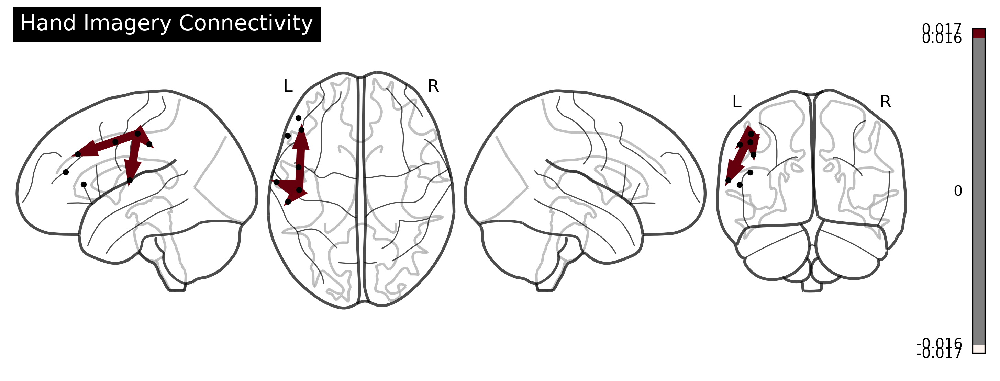
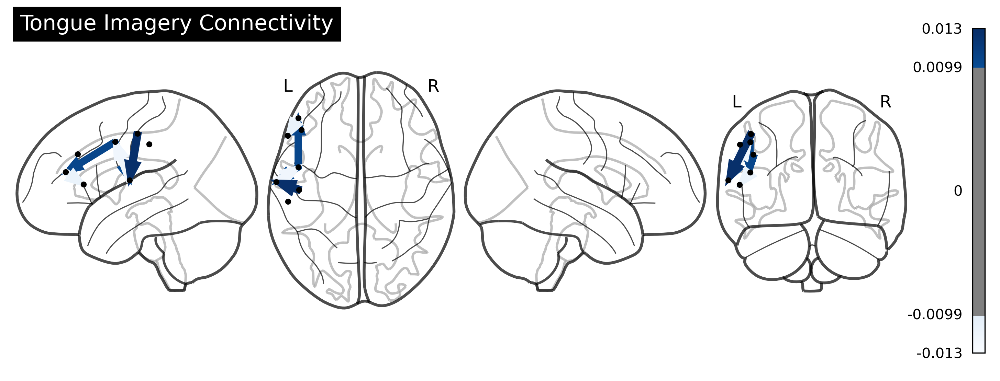
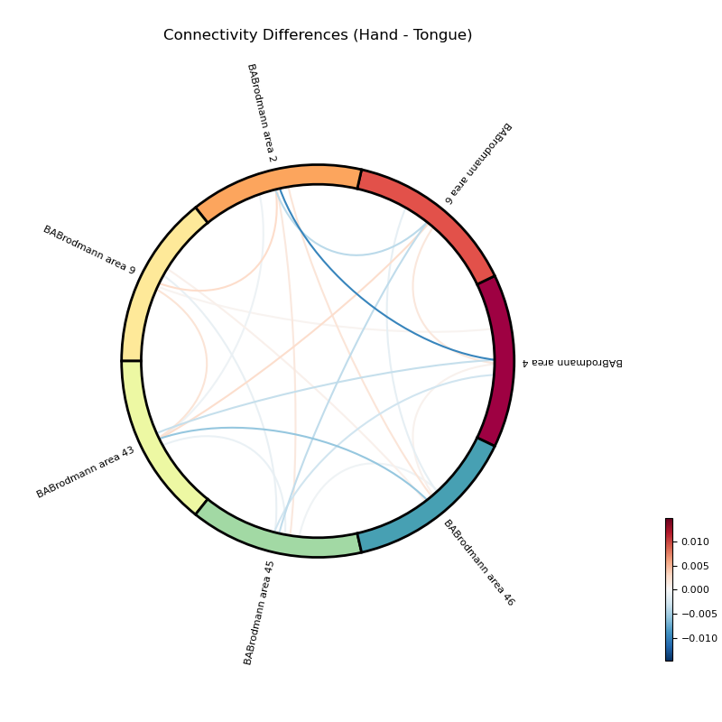

# Motor Imagery ECoG Connectivity Analysis Pipeline

An end-to-end Python pipeline for connectivity-based classification of motor imagery tasks (Hand vs. Tongue) using Electrocorticography (ECoG) data, featuring advanced machine learning and 3D connectome visualization.

## 🚀 Key Features

- **Signal Processing**: Automated artifact removal, Brodmann area (ROI) mapping, and Butterpass bandpass filtering.
- **Connectivity Estimation**: Computes trial-wise functional connectivity (wPLI, imCOH, PLV) normalized against pre-experiment baselines.
- **Machine Learning**: Implements a robust classification pipeline (SVM) with nested cross-validation and hyperparameter optimization via GridSearchCV.
- **Advanced Visualization**: Generates interactive 3D connectome plots (when electrode locations are available), circular connectivity charts, and ROI-wise heatmaps.

## 🛠️ Data Pipeline Architecture

- **Preprocessing**: Data Loading → Bandpass Filtering → ROI Validation 
- **Connectivity**: Baseline Normalization → Trial-wise Feature Extraction
- **Classification**: Standard Scaling → SVM Training → Performance Evaluation 
- **Visualization**: 3D Brain Mapping / 2D Connectivity Heatmaps → Report Generation


## 📦 Prerequisites & Installation

Ensure you have the required dependencies installed:

```python
pip install numpy scipy matplotlib seaborn scikit-learn mne-connectivity pandas
```

```bash
python main.py
```

## 📊 Outputs & Visualization

### Generated Plots
Plots are automatically saved inside the `connectome_plots/` directory.

#### 1. 3D Connectome Visualizations
<p align="center">
  
  
</p>

#### 2. Connectivity Differences
<p align="center">
  
</p>

- **Hand & Tongue Connectomes**: Detailed 3D mapping of brain network connectivity during motor imagery tasks.
- **Difference Matrix**: Contrast map highlighting the significant functional connectivity changes between Tongue and Hand imagery.

## 📁 Project Structure

```
.
├── main.py                      # Main execution script
├── preprocessing.py             # Data loading and artifact removal
├── connectivity_analysis.py     # Functional connectivity estimation
├── classification.py            # ML pipeline and SVM classification
├── visualization.py             # 3D connectome and heatmap generation
├── requirements.txt             # Dependencies
└── README.md                    # This file
```

## Methods

### Connectivity Metrics

- **wPLI** (Weighted Phase Lag Index)
- **imCOH** (Imaginary Coherence)
- **PLV** (Phase Locking Value)

### Machine Learning

- Support Vector Machine (SVM) with RBF kernel
- Nested cross-validation
- GridSearchCV for hyperparameter tuning

## Acknowledgments

- **Mentor**: Dr. David R. Quiroga-Martinez
- **Program**: Neuromatch Academy (NMA) Summer 2025

## Contact

For questions or collaborations, please reach out via:

- Email: ayoub.naderei@gmail.com
- GitHub Issues
